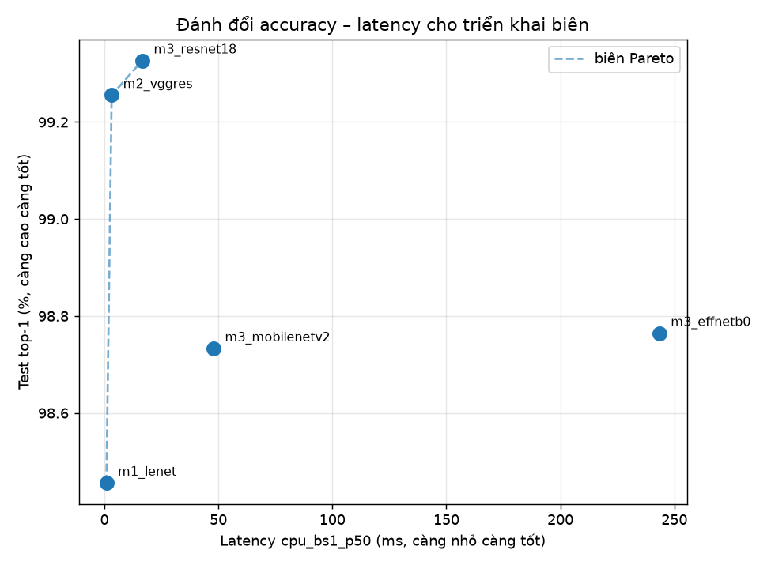
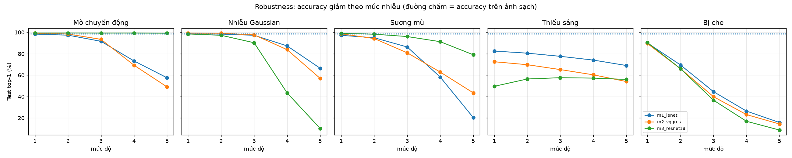
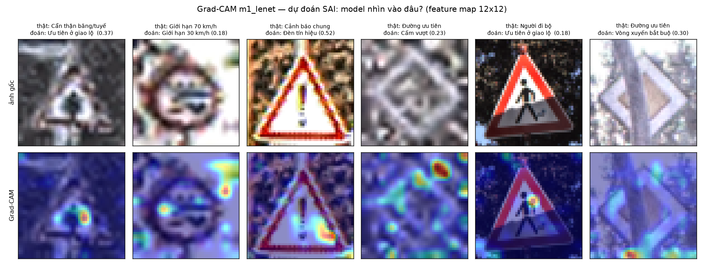

# GTSRB — So sánh 3 mô hình Deep Learning phân loại 43 lớp biển báo giao thông

Dự án môn học Deep Learning. 4 thành viên. **PyTorch**.
Code/debug local (macOS MPS), train nặng trên Google Colab.

**Trạng thái: đường ống chạy được end-to-end và đã kiểm chứng trên máy thật**
(Apple M1 Pro 16 GB, torch 2.14.1 + MPS, Python 3.12).

---

## Bắt đầu trong 3 lệnh

```bash
make setup-mac    # tạo ~/.venv, cài torch + phụ thuộc   (~5 phút)
make data         # tải GTSRB, tiền xử lý, split theo track (~6 phút, 1,1 GB)
make smoke        # chạy thử 2 epoch để chắc đường ống không vỡ (~30 giây)
```

Rồi train:

```bash
make train-m1     # ~12 phút trên M1 Pro
make train-m2     # ~24 phút
make eval         # bảng so sánh + McNemar + ECE + confusion + per-class
```

**M3 (transfer learning) nên train trên Colab** — T4 nhanh hơn MPS 3–4× ở 224×224:

```bash
make zip          # đóng gói code, 240 KB
```
rồi mở [`notebooks/00_colab_train.ipynb`](notebooks/00_colab_train.ipynb) trên Colab và
chạy 8 ô từ trên xuống. Checkpoint tự lưu lên Google Drive nên mất session không phải
train lại. Chi tiết: [docs/KE_HOACH_CHAY.md](docs/KE_HOACH_CHAY.md) mục 2.

`make help` liệt kê toàn bộ lệnh.

---

## Đọc gì trước

| Bạn là | Đọc theo thứ tự |
|---|---|
| **Thành viên mới vào nhóm** | 1. [docs/PHAN_CONG.md](docs/PHAN_CONG.md) → mục của bạn · 2. [docs/LY_THUYET.md](docs/LY_THUYET.md) → bảng *"mở file code nào thì đọc mục nào"* ở đầu · 3. [docs/INTERFACE.md](docs/INTERFACE.md) → hợp đồng code |
| **Muốn hiểu code** | đọc thẳng `src/gtsrb/` — mỗi file mở đầu bằng docstring giải thích **vì sao** thiết kế như vậy, không chỉ *làm gì* |
| **Muốn hiểu lý thuyết** | [docs/LY_THUYET.md](docs/LY_THUYET.md) — 9 phần, mỗi mục có dòng `📁 Code:` trỏ thẳng tới file/hàm hiện thực nó |
| **Sắp chạy thực nghiệm** | [docs/KE_HOACH_CHAY.md](docs/KE_HOACH_CHAY.md) — thời gian đo thật + 4 cách tiết kiệm compute |
| **Gặp lỗi lạ** | [docs/SU_CO.md](docs/SU_CO.md) — 9 nhóm sự cố **đã gặp thật**, đọc trước tiết kiệm vài giờ |
| **Muốn xem kết quả** | [docs/KET_QUA.md](docs/KET_QUA.md) |

---

## Dữ liệu

| | |
|---|---|
| Nguồn | archive gốc Đại học Bochum (ERDA), **không** qua torchvision ([lý do](docs/SU_CO.md)) |
| Kích thước | **39.209** ảnh train + **12.630** ảnh test chính thức = **51.839** |
| Lớp | 43, mất cân bằng **10,7:1** (lớp 2: 2.250 ảnh · lớp 0/19/37: 210) |
| Ảnh gốc | `.ppm`, trung vị **43×43 px** (min 25, max 266) |
| Tiền xử lý | cắt ROI (lề 10%) → CLAHE → resize 48×48 |
| Split | **theo track** → train 31.379 / val 7.830 / test 12.630 |

### ★ Split theo track — đóng góp kỹ thuật chính

GTSRB quay mỗi biển báo **vật lý** thành một track 30 frame liên tiếp. Split random
làm các frame gần như trùng nhau rơi vào cả train và val → **rò rỉ dữ liệu**.

| Cách split | Số track dùng chung giữa train và val |
|---|---|
| Random theo ảnh (**sai**) | **1.306** |
| Theo track, `StratifiedGroupKFold` (**đúng**) | **0** |

`tests/test_split.py` là **cổng chặn**: nếu nó đỏ thì mọi số liệu của dự án vô giá trị.

---

## Ba mô hình

| | Mô hình | Kiến trúc | Input | Tham số | Chủ |
|---|---|---|---|---|---|
| **M1** | LeNet-style từ số 0 | 2 × (Conv 5×5 + Pool) + 2 Dense | 48² | **2.424.299** | B |
| **M2** | VGG-like từ số 0 | 4 stage × 2 Conv 3×3 + BN + residual + SpatialDropout + GAP | 48² | **1.237.451** | B |
| **M3a** | ResNet18 pretrained | residual, conv dày đặc | 224² | 11,7 M | C |
| **M3b** | MobileNetV2 pretrained | depthwise separable + inverted residual | 224² | 3,5 M | C |
| **M3c** | EfficientNet-B0 pretrained | compound scaling + MBConv + SE | 224² | 5,3 M | C |

**Chú ý con số phản trực giác:** M2 có **9** lớp conv so với **2** của M1, mà tổng tham số
chỉ bằng **51%**. Lý do: M1 dồn **97,3%** tham số vào *một* lớp `Flatten(9216)→FC(256)`;
M2 thay chỗ đó bằng `GlobalAvgPool→FC(256→43)` chỉ 11.051 tham số.
→ **Số lớp không tỉ lệ với số tham số. Chỗ đắt là lớp fully-connected.**

---

## Kết quả

Tập test chính thức, 12.630 ảnh. Mọi số sinh tự động từ `artifacts/runs/*/result.json`.

| Mô hình | Tham số | FLOPs | Top-1 | Macro-F1 | ECE | p95 CPU |
|---|---|---|---|---|---|---|
| M3 ResNet18 | 11,20 M | 3,65 G | **99,33%** | **0,9903** | 0,1085 | 18,3 ms |
| **M2 VGG-res** *(tự xây)* | **1,24 M** | 0,29 G | 99,26% | 0,9880 | **0,0535** | **3,7 ms** |
| M3 EfficientNet-B0 | 4,06 M | 0,83 G | 98,77% | 0,9838 | 0,0973 | 256,6 ms |
| M3 MobileNetV2 | 2,28 M | 0,65 G | 98,73% | 0,9796 | 0,1076 | 49,0 ms |
| M1 LeNet | 2,42 M | 0,07 G | 98,46% | 0,9778 | 0,1310 | **1,1 ms** |

### Ba phát hiện đi ngược kỳ vọng

**1. CNN tự xây 1,24 M tham số đánh bại hai backbone pretrained ImageNet.**
McNemar: M2 vs EfficientNet-B0 p = 6,3e-07; M2 vs MobileNetV2 p = 3,9e-07; M2 vs
ResNet18 p = 0,45 (tương đương). Ảnh GTSRB trung vị chỉ 43×43 px nên upsample lên 224
không tạo thêm thông tin — lợi thế pretrained bị triệt tiêu còn chi phí vẫn phải trả đủ.
*(Lưu ý: so sánh này lẫn hai biến — pretrained và độ phân giải. Xem mục Hạn chế.)*

**2. Latency không tỉ lệ FLOPs — chênh 64 lần.**

| Mô hình | FLOPs | Latency p50 | ms/GFLOP |
|---|---|---|---|
| ResNet18 | 3,65 G | 16,7 ms | **4,6** |
| EfficientNet-B0 | 0,83 G | **243,4 ms** | **294,1** |

Chọn mô hình theo FLOPs sẽ chọn đúng mô hình **chậm nhất**.
*(Đo trên CPU Apple Silicon + PyTorch; kết quả có thể khác trên x86 hoặc GPU.)*



**3. Mô hình chính xác nhất không phải mô hình bền nhất.** M1 — yếu nhất về accuracy —
có mCE tốt nhất dưới 5 loại nhiễu mô phỏng.



### Grad-CAM: mô hình nhìn vào đâu khi nó SAI



Cột thứ tư cho thấy một ca điển hình: bản đồ nhiệt nằm trên **nền lá cây**, không nằm
trên biển báo.

---

## Phân công

| Người | Phần việc | Sở hữu | Khối lượng |
|---|---|---|---|
| **Phong Nguyễn** | M1 baseline + bảng so sánh + McNemar + slide | `models/m1_lenet`, `eval/`, `scripts/evaluate,make_report` | **nhẹ nhất** |
| **Hoàng** | M2 + training engine + ablation kiến trúc | `models/m2_vggres`, `engine/`, `models/registry` | nặng nhất |
| **Phong Trần** | M3 transfer learning + Grad-CAM + tốc độ | `models/m3_transfer`, `explain/`, `deploy/` | tốn compute nhất |
| **Huy** | Dữ liệu + rò rỉ + ablation dữ liệu + robustness | `data/`, `utils/`, `robustness/` | vừa |

Mỗi file trong `src/` ghi rõ `CHỦ: <tên>` ở đầu docstring.

Chi tiết từng việc + **38 câu hỏi ôn**: [docs/PHAN_CONG.md](docs/PHAN_CONG.md).
Lịch chạy máy + cách tiết kiệm compute: [docs/KE_HOACH_CHAY.md](docs/KE_HOACH_CHAY.md).

---

## Cấu trúc

```
src/gtsrb/          thư viện dùng chung — mỗi file ghi CHỦ ở đầu docstring
├── data/           [Huy]          download, preprocess, split, dataset, transforms
├── models/         [Phong N.] m1_lenet · [Hoàng] m2_vggres, registry
│                   [Phong T.] m3_transfer
├── engine/         [Hoàng]        train (fit dùng chung cho CẢ 3 model), losses,
│                                  schedulers, callbacks
├── eval/           [Phong Nguyễn] metrics, confusion, stats_tests (McNemar), calibration
├── robustness/     [Huy]          corruptions (5 loại × 5 mức), benchmark
├── explain/        [Phong Trần]   gradcam
├── deploy/         [Phong Trần]   speed (latency p50/p95, FLOPs), export (int8, ONNX)
└── utils/          [Huy]          seed, config, logging

scripts/            CLI, mỗi việc một lệnh (_common.py gom logic dùng chung)
configs/            YAML — MỌI siêu tham số ở đây, không hard-code
notebooks/          00 = train trên Colab (phương án dự phòng, không dùng cho số trong báo cáo)
tests/              109 test; đặc biệt test_split.py chặn rò rỉ dữ liệu
docs/               phân công, interface, lý thuyết, Q&A, sự cố, kết quả
reports/            bảng + hình cho báo cáo
artifacts/runs/     checkpoint + result.json mỗi run (không commit)
```

---

## Hạn chế

1. **Chưa chạy ablation** (30 cấu hình trên 6 trục). Hạ tầng đã sẵn
   (`make ablation-budget`) nhưng chưa chạy — đây là thiếu sót lớn nhất.
2. **Mỗi cấu hình chỉ một seed.** Chênh lệch nhỏ hơn nhiễu khởi tạo không nên kết luận.
3. **So sánh M2 với M3 lẫn hai biến** (pretrained và độ phân giải). Ablation resolution
   là bước cần thiết để tách chúng.
4. **Mức nhiễu không so sánh được giữa hai nhóm độ phân giải** với motion blur — kernel
   15 px phủ 31% ảnh 48×48 nhưng chỉ 6,7% ảnh 224×224. Kết luận robustness chỉ rút từ
   `gauss_noise`, `low_light`, `occlusion`.
5. **Đây là bài phân loại, không phải phát hiện.** Mô hình nhận biển báo đã cắt sẵn.

Chi tiết đầy đủ: [docs/BAO_CAO.md](docs/BAO_CAO.md) mục 5.

## Quy tắc nhóm

1. **Không ai sửa file của người khác.** Thấy bug → nhắn người sở hữu.
2. **Mọi siêu tham số trong YAML.** Không hard-code trong `src/`.
3. **Không chép số bằng tay** vào báo cáo. Mọi số truy được về một `result.json`.
4. **`make test` phải xanh trước khi push.**
5. **Không làm việc trong notebook.** `.ipynb` là JSON, merge rất khó. Code đi vào
   `src/gtsrb/` và `scripts/`; notebook chỉ còn `00` để chạy trên Colab.
6. **Gặp lỗi lạ → ghi 1 dòng vào [docs/SU_CO.md](docs/SU_CO.md)** để cả nhóm không mất
   thời gian hai lần.
